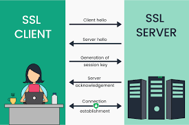

# SSL
**Secure Sockets Layer**

Mahmut Kerem Biçer

<!-- _footer: "Presentatie SSL" -->

---

# Wat is SSL

beveiligingsprotocol

<!-- _footer: "Presentatie SSL" -->

---

# Waarvoor dient SSL

- versleutelen van gegevens
- browser-server
- onderscheppen+lezen
- identiteit verifiëren

   

<!-- _footer: "Presentatie SSL" -->

---

# Wat beschermt SSL
- Persoonlijke informatie zoals creditcardnummers, adresgegevens...
- Inloggegevens zoals gebruikersnamen en wachtwoorden...
- Gevoelige bedrijfsinformatie zoals klantgegevens, financiële gegevens...
- En nog veel meer.

<!-- _footer: "Presentatie SSL" -->

---

# Hoe werkt SSL

1) verbinding via HTTPS
2) SSL-certificaat -> browser
3) sleutel
   
   

   
<!-- _footer: "Presentatie SSL" -->

---

# Slide 7
SSL is essentieel voor:
- E-commerce websites
- Inlogpagina's
- Webmail
- Andere websites die persoonlijke informatie verzamelen
- Professionele uitstraling
  
<!-- _footer: "Presentatie SSL" -->

